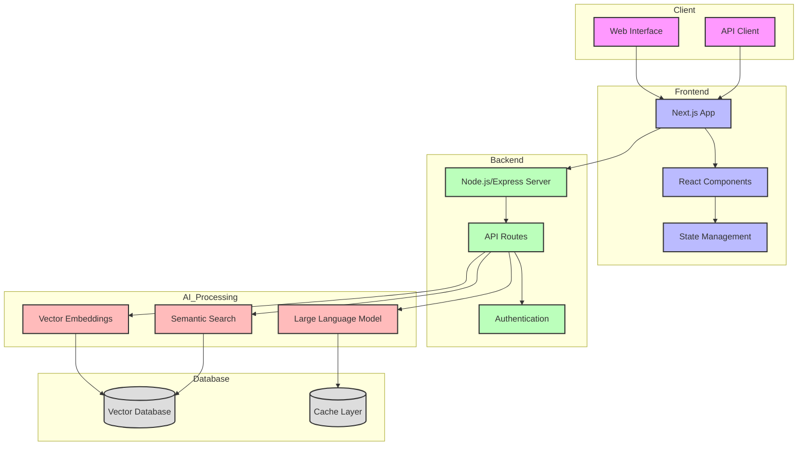

# System Architecture

## Components Overview

### Client Layer
- **Web Interface**: User-facing application
- **API Client**: Handles API communication

### Frontend Layer
- **Next.js App**: Main application framework
- **React Components**: UI components
- **State Management**: Application state handling

### Backend Layer
- **Node.js/Express Server**: Main server
- **API Routes**: Endpoint handlers
- **Authentication**: User authentication

### AI Processing Layer
- **Vector Embeddings**: Content vectorization
- **Large Language Model**: Response generation
- **Semantic Search**: Content search engine

### Database Layer
- **Vector Database**: Stores embeddings
- **Cache Layer**: Response caching

## Data Flow
1. User interacts with Web Interface
2. Requests flow through API Client
3. Next.js processes requests
4. Backend handles business logic
5. AI Processing generates responses
6. Database stores and retrieves data
7. Responses flow back to user

## Key Features
- Real-time search capabilities
- Context-aware responses
- Secure authentication
- Efficient caching
- Scalable architecture 